# 🚀 AXL Automated Report Generation Setup Guide

Transform your workflow from manual processing to **fully automated report generation** that triggers when Airtable adds new companies to Google Sheets!

## 🎯 Choose Your Automation Level

### 🔄 Option 1: Automated Polling (Easiest - Start Here!)
**Perfect for:** Getting started quickly, testing the system
**Effort:** 30 seconds to start
**Triggers:** Every 2 minutes

```bash
cd startup-report-generator/backend
python launch_automation.py
# Choose option 1
```

**What it does:**
- ✅ Checks Google Sheets every 2 minutes for new companies
- ✅ Automatically extracts PDF pitch deck content
- ✅ Generates reports with enhanced AI research
- ✅ Uploads to Google Drive with AXL-only access
- ✅ Updates sheet with shareable links
- ✅ Runs until you stop it (Ctrl+C)

---

### ⚡ Option 2: Real-Time Triggers (Most Responsive)
**Perfect for:** Production use, instant processing
**Effort:** 10 minutes setup
**Triggers:** Immediately when Airtable updates Google Sheets

#### Quick Setup:
1. **Go to [script.google.com](https://script.google.com)**
2. **Create new project** and paste code from `google_apps_script_trigger.js`
3. **Update API_ENDPOINT** with your server URL (see options below)
4. **Set up trigger:**
   - Edit > Current project's triggers > Add trigger
   - Function: `onNewRowAdded`
   - Event source: From spreadsheet
   - Event type: On edit

#### Expose Your API (Choose One):

**A) ngrok (Testing):**
```bash
# Terminal 1: Start your server
uvicorn app.main:app --reload

# Terminal 2: Expose with ngrok
ngrok http 8000
# Copy the https URL to Google Apps Script API_ENDPOINT
```

**B) Railway (Production):**
```bash
# Deploy to Railway
railway login
railway init
railway up
# Use the railway URL as API_ENDPOINT
```

**Benefits:**
- ⚡ **INSTANT processing** (no delay)
- 🎯 **Triggered by actual Airtable updates**
- 💡 **Most efficient resource usage**

---

### 🖥️ Option 3: Background Service (Production Server)
**Perfect for:** Dedicated servers, always-on processing
**Effort:** 5 minutes setup
**Triggers:** Every 2 minutes, runs as system service

```bash
# Install as system service
sudo cp axl-report-generator.service /etc/systemd/system/
sudo systemctl daemon-reload
sudo systemctl enable axl-report-generator
sudo systemctl start axl-report-generator

# Monitor
sudo systemctl status axl-report-generator
sudo journalctl -u axl-report-generator -f
```

**Benefits:**
- 🚀 **Starts automatically on system boot**
- 🔄 **Restarts automatically if crashes**
- 🖥️ **Runs in background without terminal**
- 🏗️ **Perfect for production servers**

---

## 🧪 Test Your Setup

Before going live, test everything:

```bash
python launch_automation.py
# Choose option 4 to test
```

This validates:
- ✅ Google Sheets connection
- ✅ PDF extraction functionality  
- ✅ AI API configuration
- ✅ System readiness

---

## 🔄 Complete Automated Workflow

Here's what happens when Airtable triggers the automation:

```mermaid
graph TD
    A[Airtable: Status → Reviewed - Promising] --> B[Google Sheets: New Row Added]
    B --> C[Trigger Detects New Company]
    C --> D[Extract PDF_URL from Sheet]
    D --> E[Download & Extract Pitch Deck]
    E --> F[Combine Analysis + PDF + Web Research]
    F --> G[Generate Beautiful Reports]
    G --> H[Upload to Google Drive]
    H --> I[Update Sheet with Links]
    I --> J[Mark as Processed]
```



### Enhanced Data Sources:
1. **Your Google Sheets Analysis** (100+ fields of scoring and commentary)
2. **PDF Pitch Deck Content** (founders' own materials, financials, team info)
3. **Live Web Research** (current market data via Perplexity API)

---

## 📊 What Gets Automated

### ✅ PDF Pitch Deck Processing
- Downloads PDFs from `PDF_URL` column automatically
- Extracts company taglines, team info, financial projections
- Includes technology details and product roadmaps

### ✅ Enhanced AI Research  
- Combines your analysis + pitch deck + web research
- Generates 4,000+ character comprehensive research responses
- Cross-references founder claims with market intelligence

### ✅ Beautiful Report Generation
- Professional McKinsey-style PDFs with WeasyPrint
- One-pager executive summaries (1-2 pages)
- Deep-dive analysis reports (3-5 pages)

### ✅ Secure Distribution
- Uploads to Google Drive with @axl.vc domain restrictions
- Updates Google Sheets columns CT & CU with shareable links
- Marks companies as processed to prevent duplicates

---

## 🚀 Recommended Getting Started Path

### Week 1: Testing & Validation
```bash
# Start with automated polling
python launch_automation.py  # Option 1
```
- Test with 2-3 companies
- Verify PDF extraction works with your pitch deck URLs
- Confirm reports are uploaded to Google Drive correctly

### Week 2: Production Setup
Choose between:
- **Real-time triggers** (Option 2) if you want instant processing
- **Background service** (Option 3) if you have a dedicated server

### Week 3: Monitor & Optimize
- Monitor processing logs
- Adjust check intervals if needed
- Add error alerting if desired

---

## 🔧 Troubleshooting

### No Companies Being Processed?
- Check that `generated` column is empty for new companies
- Verify status is exactly "Reviewed - Promising"
- Test Google Sheets connection

### PDF Extraction Not Working?
- Verify PDF_URL column has valid URLs
- Test with `launch_automation.py` option 4
- Check that PDFs are publicly accessible

### Reports Not Uploading?
- Verify Google Drive authentication
- Check AXL domain permissions in `axl_config.py`
- Test Drive manager manually

### API Errors?
- Verify Perplexity API key in `.env`
- Check API rate limits and quotas
- Monitor API response times

---

## 📈 Expected Results

### Enhanced Report Quality
- **Real company information** instead of generic AI content
- **Actual founder names and backgrounds** from pitch decks
- **Financial projections and metrics** from founder materials
- **Technology specifications and roadmaps**
- **Customer testimonials and case studies**

### Processing Efficiency
- **2-minute automated cycles** with polling
- **Instant processing** with real-time triggers
- **Batch processing** of multiple companies
- **Error handling and retry logic**

### Professional Distribution
- **@axl.vc domain-only access** for security
- **Automatic Google Drive organization**
- **Sheet updates with shareable links**
- **Processing status tracking**

---

## 🎯 Ready to Automate?

1. **Quick Start:** `python launch_automation.py` → Option 1
2. **Add PDF URLs** to your Google Sheets
3. **Watch the magic happen** as companies get processed automatically!

Your startup analysis workflow will be **completely automated** from Airtable trigger to beautiful, secure reports! 🎉 